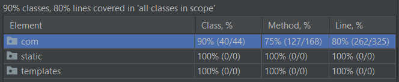

# Collectibles Application

This project is a CRUD application for collecting books and quotes created using Spring Boot and REST API. 
Frontend of the application is created with Vaadin Framework as a separate Spring Boot application.

## Current features of the application:

- storing books in custom collections 
- browsing an open library for new books to add to the collection
- storing quotes in the app
- daily quotes update that adds a new random quote to the collection
- both books and quotes are editable
- homepage features a random quote updated on refresh

## Running the application

Here's how to run the application in few easy steps:

1. Download front app from [this repository](https://github.com/MartaKruk/collectibles-vaadin) and run it locally
2. Front app is set up on port [8081](http://localhost:8081/) - should open automatically

Another way - in case you want to run both apps locally:

1. Download back app from [this repository](https://github.com/MartaKruk/collectibles) and front app from [this repository](https://github.com/MartaKruk/collectibles-vaadin)
2. In the front app go to `src/main/resources/application.properties` and change `collectibles.app.endpoint` value to `http://localhost:8080`
3. Run MySQL database server with credentials as listed in `src/main/resources/application.properties` in backend app
4. Run both applications locally
5. Front app is set up on port [8081](http://localhost:8081/) - should open automatically

## Useful links

Repository for the backend app: [github.com/MartaKruk/collectibles](https://github.com/MartaKruk/collectibles)

Repository for the frontend app: [github.com/MartaKruk/collectibles-vaadin](https://github.com/MartaKruk/collectibles-vaadin)

Backend app on heroku: [collectibles-application.herokuapp.com](https://collectibles-application.herokuapp.com)

Backed API documentation generated using Swagger: [collectibles-application.herokuapp.com/swagger-ui.html](https://collectibles-application.herokuapp.com/swagger-ui.html)

Open Library API used to browse books: [openlibrary.org/dev/docs/api/search](https://openlibrary.org/dev/docs/api/search)

QuoteLib API used to generate a random quote: [rapidapi.com/Jujo/api/quotelibapi](https://rapidapi.com/Jujo/api/quotelibapi/)

## Test coverage

## Features in development

Planned improvements are listed below:

- [ ] Deployment of front app to Heroku
- [ ] User log in and authentication
- [ ] Adding books to collection directly from the search results
- [ ] Refactoring frontend application so that it uses in-app objects instead of dtos
- [ ] Adding paging to open library search results